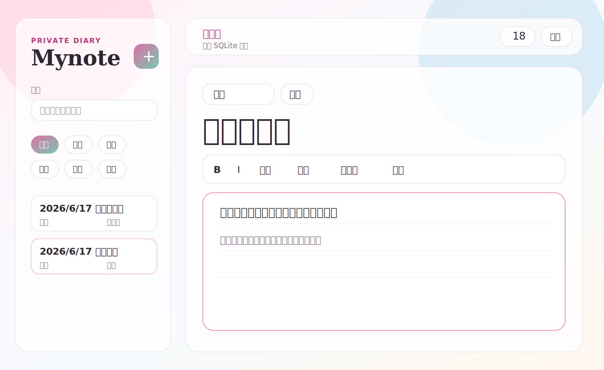

# Mynote

Mynote 是一个轻量、清爽、偏私人使用的电脑日记应用。它的目标不是做复杂知识库或云同步平台，而是提供一个双击即写、本地保存、自动备份、可恢复的桌面记录工具。



## 适合做什么

- 每天打开就写的私人日记
- 读书摘抄、灵感、想法记录
- 不想登录、不想同步、不想把内容放到云端的本地记录
- 需要搜索、分类、置顶、软删除恢复的轻量笔记管理

## 快速体验

下载仓库中的 `Mynote.exe`，双击即可运行。

数据默认保存在程序所在目录的 `data/` 文件夹中。该目录已被 `.gitignore` 永久忽略，避免误把私人日记提交到仓库。

## 功能

- 启动即写：自动打开上次编辑的笔记，否则创建今天的日记
- 自动保存：输入停顿后自动保存
- 本地 SQLite：不需要账号，不依赖网络
- 分类：日记、摘抄、想法、学习、项目、情绪
- 搜索：标题和正文关键词搜索
- 置顶：重要笔记固定在列表上方
- 软删除：删除后进入回收站，可恢复
- 备份：支持自动备份和手动备份
- 富文本基础编辑：加粗、斜体、列表、引用块、分割线、清除格式

## 使用步骤

1. 双击 `Mynote.exe`。
2. 应用会自动进入上次打开的笔记。
3. 直接在正文区域输入内容。
4. 停顿片刻后会自动保存。
5. 使用左侧列表、搜索和分类找回旧笔记。
6. 关闭窗口即可退出。

## 实现原理

Mynote 使用 Tauri 2 构建桌面外壳，前端是原生 HTML/CSS/JavaScript，后端是 Rust 命令层。前端通过 Tauri `invoke` 调用 Rust 后端，Rust 使用 `rusqlite` 直接读写本地 SQLite 数据库。

数据流大致是：

```text
Tauri 桌面窗口
  -> HTML/CSS/JavaScript UI
  -> Tauri invoke
  -> Rust 后端命令
  -> SQLite 本地数据库
```

这种方式不需要启动本地 HTTP 服务，也不会把数据发送到网络。

## 局限性

- 当前没有云同步，多设备同步需要自己复制数据库或备份文件。
- 当前没有加密数据库，若电脑账号或磁盘没有保护，数据库文件本身可被读取。
- 富文本能力偏基础，不是完整排版编辑器。
- 目前主要面向 Windows 桌面环境测试。
- `Mynote.exe` 是快速体验构建，不等同于正式安装包或签名发行版。

## 从源码构建

需要 Node.js、npm、Rust/Cargo 和 Tauri 构建环境。

本项目提供了构建脚本：

```powershell
./build_exe.ps1
```

构建完成后会更新根目录的 `Mynote.exe`。

## 隐私说明

仓库不会提交本地日记数据库、备份、构建缓存和本地规划文档。请不要手动提交 `data/`、`*.db`、`task.md`、`todolist.md`、`test.md` 等本地文件。

